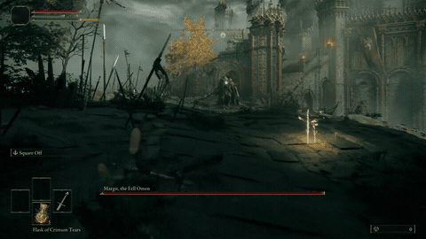
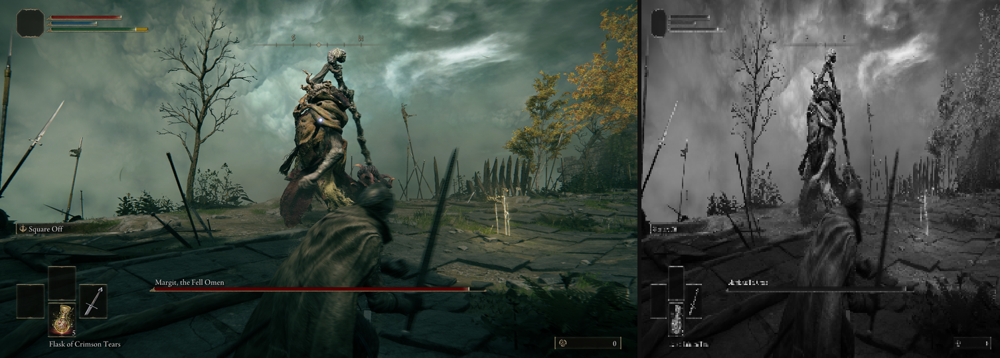
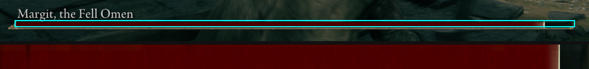
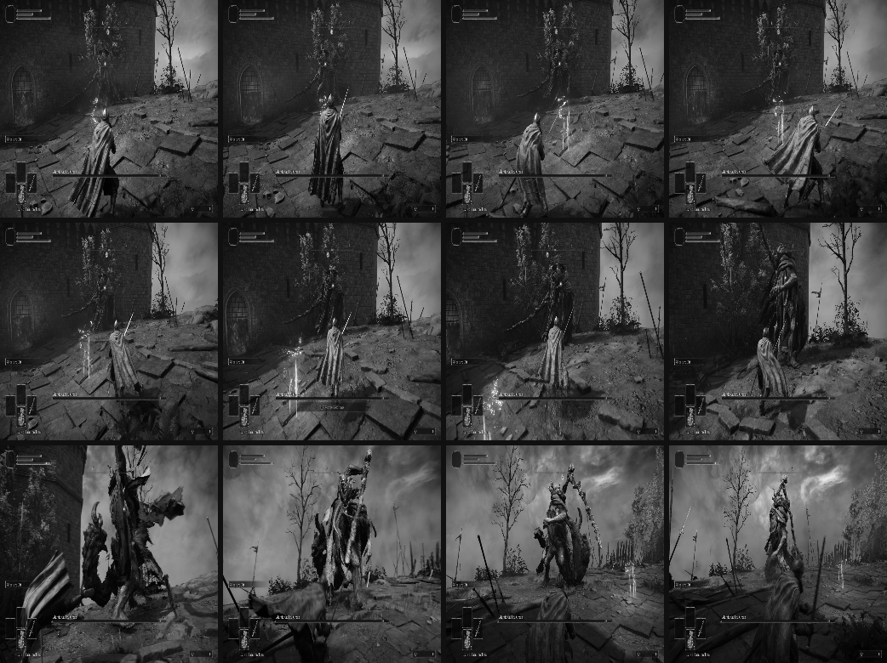

# Elden Ring AI (G.A.L.E.)

A level one Vagabond with a sword, no shield and no summons, learning to fight **Margit, The
Fell Omen** by watching the screen.

Elden Ring has no API, so every channel between the agent and the game had to be built. Frames
come out of the Wayland compositor through a video pipe. Button presses go in through a virtual
gamepad, which is the easy part. State is the hard part: nothing in the game will tell you how
much health you have, so the agent locates a base address by scanning the running process for a
byte signature and walks a pointer chain from it. Margit's health is the one it never found a
pointer for, so that one it reads off the pixels of his health bar.

Then it has to survive being left alone. It walks itself from the grace to the fog gate, confirms
it really is inside the arena before it learns anything from what it sees, waits out its own
deaths, and when the game crashes it relaunches it through Steam, re-scans for the pointer and
carries on. It restores the save after every victory so no two episodes ever start from a
slightly different character. That is what lets it train for days with nobody in the room.

<!-- PENDENT: descomentar quan hi hagi docs/media/fight.gif i l'enllac real


*[Full fight on YouTube](https://youtube.com/watch?v=PENDENT)*
-->

## The three channels

Everything between the policy and the game, in order.

```
   wf-recorder -> v4l2loopback -> OpenCV        /proc/<pid>/mem
              (screen frames)                  (HP, stamina, area)
                     |                                |
                     +--------------+-----------------+
                                    |
                          EldenRingEnv (Gymnasium)
                                    |
                        PPO policy + custom CNN
                                    |
                          evdev UInput virtual pad
                                    |
                              Elden Ring
```

**Vision.** `wf-recorder` streams the Wayland output into a `v4l2loopback` device and OpenCV
reads the frames back out of it. They get downscaled to 256x256 greyscale, which is what the
network actually sees. The aspect ratio is not preserved: a 16:9 frame is squashed into a
square, and the policy learns on the squashed version.



**State.** Player health, stamina, readiness and the current area ID come straight out of the
game process through `/proc/<pid>/mem`, walking a pointer chain from a `WorldChrMan` base
address I locate with an AOB signature scan.

Margit's health is the exception: I never found a reliable pointer to it, so I read it from
pixels instead, off the bar itself. That is why the vision config carries brightness and
saturation thresholds. They are a bar-reading algorithm, not display settings.



**Control.** A virtual Xbox 360 pad built with evdev `UInput`. The game cannot tell it apart
from real hardware. Twelve discrete actions: move, sprint, guard, jump, dodge, heal, light
attack, heavy attack and doing nothing, six of them held toggles rather than taps.

## What it sees

A single frame cannot express "I just committed to a heavy attack". Without that, the agent has
no way of knowing it is already locked into an animation it cannot cancel.

So the observation is a stack of 12 frames rather than one, plus 24-step histories of the
actions it took, its own health, its stamina, and whether it damaged Margit on each of those
steps.



## How it decides

### The character

I wanted the most basic build possible, so I picked Vagabond at level one and never levelled it
up. It has to win by actually dodging, not by being overpowered.

I started with a shield, and parrying and blocking gave good enough results that I never
questioned it. Then I trained a whole run two-handed by mistake, which meant training without a
shield at all, and that run was the more interesting one to watch. Only then did I work out why:
the shield had been pulling the agent away from dodging, which is the thing I actually wanted it
to learn. I kept the mistake. It also shrinks the action space for free.

### Micro episodes

The reward function is the hardest part of the project and the one I have rewritten the most.
My current framing I call micro episodes: short windows, currently 4.8 seconds, that contain
everything needed to judge the next action.

It comes from not thinking about defeating Margit at all, but about dealing damage without being
hit, indefinitely, which is in fact the correct way to play a Souls game. Dodging now does not
meaningfully affect a decision ten seconds from now, because by then the outcome already carries
whatever information that step needs.

The gamma of 0.96, the vision window and the stat histories all match that window. Actions get
judged on their own context. Healing right before being hit has to be punished; healing and
being hit ten seconds later has nothing to do with it.

### The one number underneath it

All the reward weights come down to a single ratio: **how much a hit taken costs against what a
hit landed pays**. Killing Margit takes about 36 sword hits, and four of his kill me. The game's
own rate is therefore roughly 1 to 9 against trading blows.

The reward is deliberately gentler than the game, currently 2 to 1, because an agent that
respects the real rate learns to run away instead of fighting.

There used to be a per-step penalty here too, to stop it standing still. It turned out to be
paying most of the incentive to attack, since landing a hit switched the penalty off for the
next 24 steps, and it scored long episodes worse than short ones, which means the reward was
ranking survival as failure. It is gone.

## Why a win restarts the game

Episodes run from the fog gate until it dies or wins, with no step limit. A win does not end
training, because the goal is mastering Margit rather than beating him once.

That is a problem, because beating him leaves him permanently dead in the save. So on a victory
the environment kills the game, copies the backup save over the live one and relaunches. It
recovers the same way after a crash, and the reason is the same in both cases: every episode has
to start from an identical character, or the thing being learned drifts underneath the agent.

## Watching it learn

There is a live dashboard that redraws at the end of every episode, with the reward composition,
the event rates and the PPO metrics.

<!-- PENDENT: descomentar quan hi hagi docs/media/dashboard.png

-->

Every run also writes its own folder with the config that produced it, one row per episode, the
per-step rewards and the reason for each, and a log of every recovery and abort.

Each long run gets written up in [`analysis/`](analysis/): what the numbers said, what broke, and
what the next round changed because of it.

## Status

It trains unattended for long runs and recovers from crashes on its own. It has not beaten Margit
yet. The infrastructure is done and what is left is the reward function and the hyperparameters,
which I am still tuning, so treat them as an open experiment rather than a recipe known to
converge.

Suggestions are welcome.

## Running it yourself

It is not portable as-is: it was built against my machine, and getting it running elsewhere means
changing config, not just installing it. [`docs/RUNNING.md`](docs/RUNNING.md) has the
requirements, the setup, every command, the layout of the code and the things that will bite you.

## License

GNU General Public License v3.0 or later, full text in [`LICENSE`](LICENSE).

Copyright (C) 2026 Teo Raichman.
